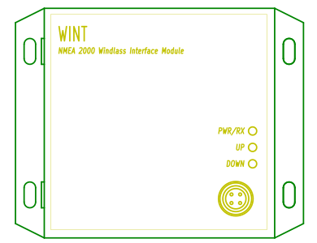
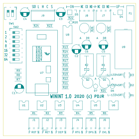

# TSENSE - temperature sensor module (1.0)

## Schematic design

This design is based on a
[Teensy 3.2](https://www.pjrc.com/store/teensy32.html)
MCU.

Module power at 5VDC is supplied by an isolated
[Traco Power TMR 1-1211](https://tracopower.com/tmr1-datasheet/)
DC-DC converter] fed directly from the NMEA 2000 power bus through
a 500mA self-resetting fuse.
The module has a nominal current draw of 100mA (1 LEN).

The module data interface is implemented using a
[MicroChip MCP2551](http://ww1.microchip.com/downloads/en/devicedoc/21667e.pdf)
high-speed CAN transceiver.
CAN H and L signals are conditioned through simple RC filtering.
A switch allows the installer to select whether or not to connect
the host bus screen to the module ground plane.

Eight input channels implemented as simple voltage dividers
support connection of
[National Semiconductor LM335Z](https://www.switchelectronics.co.uk/pub/media/pdf/LM335Z.pdf)
precision temperature sensors. 

A DIP switch, momentary push-button and associated LEDs provide
a user configuration interface and module status interface.

## Physical design

### Enclosure

The proposed enclosure is a shallow flanged ABS module designed to
accommodate an 80x80 PCB.

The enclosure must be machined to accommodate a standard NMEA cable connector,
two 6mm cable grommets and three 3mm LED indicators.
 

### PCB

This first-generation design uses through-hole components and is
implemented as an 80mm by 80mm x 1.6mm two-layer 1oz copper PCB.
 

### Parts list

| Part            | Proposal |
|:----------------|:---------|
| MCU             | [Teensy 3.2](https://www.pjrc.com/store/teensy32.html) |
| DC-DC converter | [TEC2-2411WI](https://www.tracopower.com/products/tec2wi.pdf) |
| CAN transceiver | [MCP2551](https://docs.rs-online.com/f763/0900766b8140ba57.pdf) |
| Opto-isolator   | [PC817](http://www.soselectronic.cz/a_info/resource/d/pc817.pdf) |
| Relay           | [RS 476-757](https://docs.rs-online.com/df01/0900766b8158318b.pdf) |
| Enclosure       | [RS 919-0357](https://docs.rs-online.com/960c/0900766b814af9a1.pdf) |
| NMEA connector  | [M12 5-pin connector](https://docs.rs-online.com/e3ad/0900766b8152901f.pdf) |

## Connections

### NMEA

The module's female NMEA connector will directly accept an NMEA
standard drop cable.

### Sensor input channels

Each input channel is presented as P (positive) & N (neutral) terminals
and will accept input signals in the range 9VDC through 32VDC.
At 12VDC each input channel will draw 9mA from the signal supply.

| Channel | Required | Input characteristic |
|:--------|:---------|:---------------------|
| ROT     | Yes      | One pulse per windlass spool revolution. |
| RTD     | Yes      | On when the ground tackle operated by the windlass is fully retrieved. |
| DPD     | Yes      | On when the ground tackle is fully deployed. |
| RTG     | No       | On when the windlass is retrieving its cable. |
| DPG     | No       | On when the windlass is deploying its cable. |
| OVL     | No       | On when the windlass is experiencing or about to experience an overload condition |

The module will operate with just three external inputs.
Providing the RTG and DPG inputs improves fault-detection and status reporting.
Providing the OVL input allows more refined windlass control.

### Relay output channels

Each output channel is presented as CO, NO and NC terminals rated at
50VDC 2A.
The CO-NO circuit on each channel is snubbed.

| Channel | Output characteristic |
|:--------|:----------------------|
| RUP     | CO-NO closed when windlass should retrieve its cable. |
| RDN     | CO-NO closed when windlass should deploy its cable. |

### Switches and indicators

### Switch inputs

Switch inputs are provided through two DIL switch modules.

| Module   | Pole | Description |
|:---------|:----:|:------------|
| CONFIG   | 1    | Close to enable relay output. |
| CONFIG   | 2    | Close to connect NMEA cable shield to module ground. |
| INSTANCE | 1    | NMEA instance number bit 0. |
| INSTANCE | 2    | NMEA instance number bit 1. |
| INSTANCE | 3    | NMEA instance number bit 2. |
| INSTANCE | 4    | NMEA instance number bit 3. |
| INSTANCE | 5    | NMEA instance number bit 4. |
| INSTANCE | 6    | NMEA instance number bit 5. |
| INSTANCE | 7    | NMEA instance number bit 6. |

### Indicator outputs

There is a single LED indicator on the MCU and five LED indicators
on the PCB, three of which are visible through the module enclosure.

| LED        | Description | 
|:-----------|:------------|
| MCU        | Modulated on a successful firmware boot, otherwise no module specific use (see MCU documentation). |
| UP relay   | Illuminates when the UP relay NO contact is closed. |
| DOWN relay | Illuminates when the DOWN relay NO contact is closed. |
| PWR        | Shows power state and is modulated when NMEA operating commands are being received. | 
| UP         | Modulated to reflect the windlass retrieve state. Modulated in concert with DOWN to indicate overload condition. |
| DOWN       | Modulated to reflect the windlass deploy state. Modulated in concert with UP to indicate overload condition. | 

