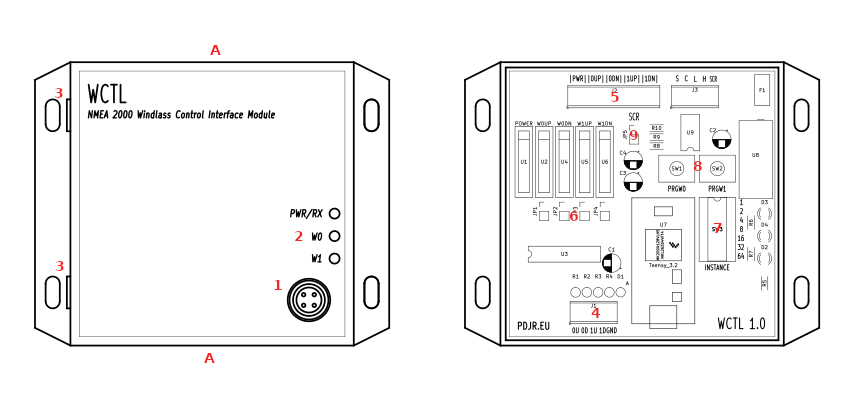
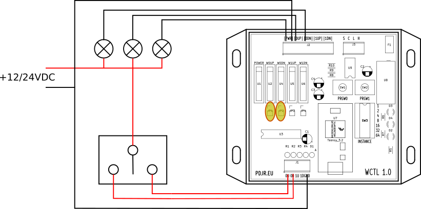

# WCTL - NMEA 2000 windlass control interface module.

__WCTL__ is an NMEA 2000 module which allows a physical control panel
made up of switches and indicators to operate one or two NMEA 2000
enabled windlasses.
The module uses the N2K [Windlass Network Messages](
https://www.nmea.org/Assets/20190613%20windlass%20amendment,%20128776,%20128777,%20128778.pdf)
protocol to transmit commands to and receive status information from
associated windlasses.

__WCTL__ connects to the NMEA bus by a standard M12 5-pin circular
connector and is powered directly from the NMEA bus.
The module will accept supply voltages in the range 9VDC to 36VDC and
has an NMEA LEN of 1.

Switch input signals in the range 12VDC to 24VDC nominal are used to
command UP and DOWN windlass motion and zero-volt UP and DOWN output
relays support the connection of panel indicators.

__WCTL__ is configured by a PCB mounted DIP switch which allows entry
of NMEA instance addresses which define the windlass or windlasses that
are to be controlled.
Status and diagnostic LEDs confirm NMEA connection and operating state
of the device.

Multiple control interface modules can be installed on a single NMEA
bus controlling the same or different windlasses as their peers.

## About the module

Figure 1 illustrates the appearance of the module with the cover in
place and with the cover removed.

The top cover includes the NMEA bus connector (1) and three status
LEDs (2). The cover is penetrated by two cable glands (3) which allow
passage of switch and indicator connection cables.

The top cover is released by pinching at (A) after which it can be
lifted away from the the base to expose the printed circuit board (PCB).
The PCB has connectors for switches (4) and indicators (5) and four
jumpers (6) which allow one side of the control channel relays to be
independently commoned with one side of the PWR indicator relay.
A DIL switch (7) allows entry of a windlass instance number and two
programme switches (8) allow this number to be saved to module memory.
Finally, a jumper (9) determines whether or not to connext the NMEA
cable shield to the module ground.

### (1) NMEA bus connector
The module uses an M12 circular female 5-pin industrial connector for
NMEA connection.
Any standard compliant N2K drop cable will allow the module to be connected
to a host NMEA bus through a T-connector.

### (2) Status LEDs 
The three status LEDs labeled PWR/TX, W0 and W1 are modulated to provide
diagnostic feedback that is especially relevant to the installer.

| LED    | Illumination state                | Meaning |
|:------:|:----------------------------------|:--------|
| All    | Three rapid flashes               | The module has just been connected to power and is initialising.|
| PWR/RX | Steady                            | The module has power.|
|        | Occulting                         | The module is receiving NMEA data from a configured windlass. |
| W*n*   | Two flashes, repeating            | Control channel W*n* has not been configured with the instance number of the windlass it should operate. See "Configuring the module" below. |
|        | One flash, repeating              | Control channel W*n* has been configured with an instance number, but has not received a transmission from the specified windlass. See "Configuring the module" below. |
|        | Unlit                             | Control channel W*n* is operating normally but is inactive. |
|        | Steady                            | Control channel W*n* is active (input *n*U or *n*D is high). |

### (3) Cable glands
Two 6mm cable glands allow passage of switch and indicator connection
cables.

### (4) Switch connector
The switch connector is a five-pole connector with a common GND 0VDC
reference and inputs 0U, 0D, 1U and 1D for windlass switch inputs.

| Terminal | Function                     | ON                           |
|:--------:|:-----------------------------|------------------------------|
| 1 (0U)   | Retrieve cable on Windlass 0 | 12 - 24VDC nominal, max 20mA |
| 2 (0D)   | Deploy cable on Windlass 0   | 12 - 24VDC nominal, max 20mA |
| 3 (1U)   | Windlass 1 UP    | 12 - 24VDC nominal, max 20mA |
| 4 (1D)   | Windlass 1 DOWN  | 12 - 24VDC nominal, max 20mA |
| 5 (GND)  | Ground reference | 0VDC                         |

### (5) Indicator connector
The indicator connector block is a zero-volt connection for PWR, 0UP, 0DN,
1UP and 1DN indicators. The relays which support the connections are
modulated dependent upon status data received from the remote windlasses
configured for the two module control channels.

| Indicator | Illumination state                | Meaning |
|:---------:|:----------------------------------|:--------|
| All       | Three rapid flashes               | The module has just been connected to power and is initialising.|
| PWR       | Steady                            | The module has power.|
|           | Occulting                         | The module is transmitting NMEA control messages.|
| *n*UP     | Steady                            | The tackle (anchor, spudpole, etc.) attached to windlass *n*  is fully retrieved and docked.|
|           | Isophase                          | Windlass *n* is retrieving its associated tackle.|
| *n*DN     | Steady                            | The tackle attached to windlass *n* is deployed.|
|           | Isophase                          | Windlass *n* is deploying its associated tackle.|

### (6) Indicator jumpers
Four removable jumpers allow the use of separate or common connections for
one side of each of the zero volt indicator connections.
With the jumpers removed, each output channel is independent; placing a
jumper for an output channel commons the even numbered terminal for that
channel with PWR channel terminal 2.
In this way, a single power or ground connection to PWR pin 2 can be shared
by one or more other output channels, simplifying wiring to the module
indicator outputs.

### (7) Instance DIL switch
The INSTANCE DIL switch allows the entry of instance numbers in the range
0 through 127 using a binary representation. The value 127 has special
significance to the module and if programmed will disable the associated
control channel.
Normally, the INSTANCE switch is used to enter the instance numbers of the
windlasses that are controlled by the module.
The seven slide switches are each labelled with their corresponding decimal
value and the sliders are active when in the right-hand position.
For example, to enter the instance number 10, the swithces should be set
LRLRLLL (top to bottom).

### (8) Programme switches
The PRGW0 and PRGW1 switches save the address set up on (6) to the module's
EEPROM memory, associating the specified remote windlass with the selected
module control channel (or disabling the control channel if the INSTANCE
address is set to 127).

### (9) SCR jumper
With the jumper in place the NMEA cable shield is connected to the module
ground plane.

## Installing the module

1. Position the module close to the switches and indicators which you intend
   to use for operation and feedback, ensuring that you are able to remove
   the top cover for access to the PCB switches and that you have space to
   route the various connecting cables.
   Fix the module to its supporting surface with appropriate fasteners.

2. Ensure that there is a T-connector or multi-drop connector available on
   the NMEA bus you have chosen to host the module and connect an NMEA drop
   cable to the module and route it to the bus connector.
   If your host NMEA bus is poered, do not connect the drop cable to the bus
   at this stage: the module must remain unpowered until installation is
   complete.
   
3. Carefully remove the module cover.
   Inside the module, the NMEA connector is wired to the PCB with a 150mm
   long cable which should allow you to conveniantly position to one side
   so that you can access the module connector blocks.
   Do not place excessive strain on the internal NMEA connector cable.
   
4. Wire the switches and indicators that constitute your chosen control
   interface.
   The minimum functional requirement for any channel is that U0 and D0
   are connected to an operating switch of some form.
   
   Fig 2 gives an illustrative schematic for a simple wiring arrangement
   that incorporates a SPDT switch and three indicators in support of
   a single windlass channel.
   Note the use of jumpers on the indicator outputs to allow the use of
   the PWR GND connection for outputs 0UP and 0DN.
  
5. The power supply to the module should be fused at a level that supports
   your chosen indicators (the switch input current requirement is
   negligible at around 40mA).
   .

   
## Configuring the module

To operate correctly the module must be configured with the NMEA instance
of the windlasses which are being controlled.
If only one windlass is to be controlled then a special instance value can
be used to disable the unused channel.
The module is supplied with channe W0 unconfigured and channel W1 disabled.

To configure a windlass control channel.

1. Inspect the windlass which is to be controlled and identify the instance
   number that has been assigned to its NMEA interface.
2. Connect the module to the NMEA bus and confirm that it has power.
3. If you have connected switches to the SWITCH terminal block, then
   ensure that the switches are in the OFF position.
4. Enter the instance number of the windlass you wish to control (i.e the
   value identified at (1)) using the DIP switch on the module PCB.
   The module allows instance numbers in the range 0 through 126 to be
   entered.
   An instance number of 127 can be used to disable a control channel.
5. Press the PRGW0 button on the module PCB to store the windlass instance
   number for channel W0 or PRGW1 to store the instance number for channel
   W1.

If the NMEA interface on the remote spudpole is powered up, then after
a few seconds the module status LED for the selected control channel should
turn off and the status outputs for windlass should become active to indicate
the condition of the windlass.
After this, the switch inputs for the channel should command the remote
windlass.

You can repeat this procedure at any time to update a configuration or
programme a second windlass.

### Configuration issues

Configuration problems are indicated by the status LEDs on the module top
cover.
After programming an instance number to a control channel, the corresponding
channel status LED should turn off.

### Status LED flashes twice and repeats.
The module channel has not been programmed - i.e. a windlass instance number
has not saved to module memory.

1. Re-programme the instance number.
   Make sure that you press and hold the relevant programme switch for one second.
   
### Status LED flashes once and repeats for more than ten seconds.
No messages have been received from the windlass identified by the programmed
instance number.

1. Make sure the remote windlass interface module is powered.
2. If you have more than one NMEA bus, make sure that both the windlass and
   the control module are connected to the same bus or that the busses are
   bridged.
3. Check/replace the drop cables used at both the windlass and the control
   module.
4. Check the instance number of the windlass and programme it into the module
   again.
5. Use an NMEA monitor programme to confirm that the remote windlass is
   transmitting PGN 128777 Windlass Operating Status messages.

## NMEA 2000 messages

In addition to the usual N2K network management messages the module
accepts the following message types and processes them to drive its
status outputs.

| PGN    | Message name                      | Comment               |
|:-------|:----------------------------------|:----------------------|
| 128776 | Anchor Windlass Control Status    | Drives status outputs |
| 128777 | Anchor Windlass Operating Status  | Drives status outputs |

The module issues the following control message types in response to
signals on the switch inputs.

| PGN    | Message name                      | Comment               |
|:-------|:----------------------------------|:----------------------|
| 126208 | Command Group Function            | 250ms transmition rate|

