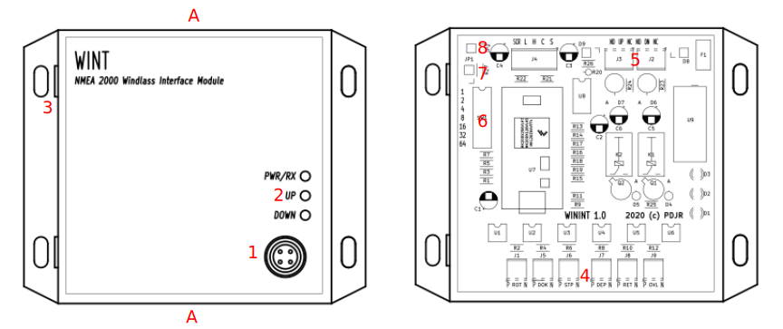

# WININT - NMEA 2000 windlass interface module

__WININT__ is an NMEA 2000 module which implements a windlass operating
interface.

The module accepts commands and issues status reports using the N2K
Windlass Network Messages protocol described in this
[Technical Bulletin]( https://www.nmea.org/Assets/20190613%20windlass%20amendment,%20128776,%20128777,%20128778.pdf).

__WININT__'s hardware interface was developed to support pole anchors
built by the manufacturer ANKREO, but it may well be useful with other
windlass-based hardware that can provide similar sensor inputs and can
be operated by simple UP and DOWN control signals.

__WININT__ connects to the NMEA bus by a standard M12 5-pin circular
connector and is powered directly from the NMEA bus.
The module has an NMEA LEN of 1.5.

Two control output channels, UP and DOWN are implemented as volt-free
2A relays.
The NO outputs are snubber protected for use with inductive loads and
are suitable for operating electric winch relays or hydraulic valve
solenoids.
Six optically isolated sensor input channels can be connected to 12/24V
external signals.
Diagnostic LEDS confirm NMEA connection and module operating status.

The module is configured by a PCB mounted DIP switch which allows entry
of an NMEA instance address that identifies the installation and
allows multiple __WININT__ modules to co-exist on the same network.

## About the module



Figure 1 illustrates the appearance of the module with the cover in
place and with the cover removed.

The top cover includes the NMEA bus connector (1) and three status LEDs
(2).
The cover is penetrated by two cable glands (3) which allow passage of
switch and indicator connection cables.

The top cover is released by pinching at (A) after which it can be
lifted away from the the base to expose the printed circuit board
(PCB).
The PCB has connectors for sensors (4) and relay outputs (5).
A DIL switch (6) allows entry of a windlass instance number and
finally, a jumper (7) allows connection of the NMEA cable shield to the
module ground.

### (1) NMEA bus connector

The module uses an M12 circular female 5-pin industrial connector for
NMEA connection.
Any standard compliant N2K drop cable will allow the module to be
connected to a host NMEA bus through a T-connector.

### (2) Status LEDs

The three status LEDs labeled PWR/TX, UP and DOWN are modulated to
provide diagnostic feedback that is especially relevant to the
installer.

| LED       | Illumination state  | Meaning                                                          |
|:---------:|:--------------------|:-----------------------------------------------------------------|
| All       | Three rapid flashes | The module has just been connected to power and is initialising. |
| PWR/RX    | Steady              | The module has power.                                            |
|           | Occulting           | The module is receiving NMEA data from a configured windlass.    |
| UP        | Steady              | The spudpole docked sensor is active.                            |
|           | Flashing            | The spudpole UP relay is on.                                     |
| DOWN      | Steady              | The spudpole stopped sensor is active.                           |
|           | Flashing            | The spudpole DOWN relay is active.                               |
| UP & DOWN | Flashing            | The overload sensor is active.                                   |

### (3) Cable glands

Two 6mm cable glands allow passage of switch and indicator connection
cables.

### (4) Sensor connection

These 2-pole screw connectors supports six optically isolated sensor
input channels.

| Terminals | Label |                                                         |
|:----------|:------|:--------------------------------------------------------|
| P & N     | ROT   | Rotation sensor (1-pulse per revolution).               |
| P & N     | DOK   | Docked sensor (active when anchor fully retracted).     |
| P & N     | STP   | Stopped sensor (active when anchor fully deployed).     |
| P & N     | RET   | Retrieving sensor (active when windlass is pulling in). |
| P & N     | DEP   | Deploying sensor (active when windlass is letting out). |
| P & N     | OVL   | Overload sensor (active when ground tackle is stuck).   |

Each sensor input consists of a P-terminal which accepts a +12VDC or
+24VDC signal relative to the N-terminal.

### (5) Relay outputs

Two relay output channels, UP and DOWN are provided for controlling an
electric windlass winch motor or solenoid operated hydraulic valves.

The NO terminal on each channel is snubbed.

### (6) Instance DIL switch

The INSTANCE DIL switch allows the installation to be assigned an NMEA
instance number in the range 0 through 127.
The seven slide switches are each labelled with their corresponding
decimal value and the sliders are active when in the right-hand
position.
For example, to enter the instance number 10, the switches should be
set LRLRLLL (top to bottom).

### (7) SCR jumper

With the jumper in place the NMEA cable shield is connected to the
module ground plane.

### Installing the module


### (7) 
The relays are rated 63V 5A and the NO contacts are snubber protected.
 

| Version | MCU                   | Released  | Comment                   |
|:--------|:----------------------|:----------|:--------------------------|
| 1.0     | Teensy 3.2            | July 2020 | First release.            |

## N2K interface

__MODINT__ connects to the host N2K bus through a standard M12 5-pin male
connector.  The module includes a selectable bus termination resistor
allowing connection as a terminating device on the host bus.

In addition to the usual N2K network management messages the module
generates the following message types:

| PGN    | Message name                      | Freq of transmission       |
|:-------|:----------------------------------|:---------------------------|
| 128776 | Anchor Windlass Control Status    | 5s (passive), 500ms (active) |
| 128777 | Anchor Windlass Operating Status  | _ditto_                    |
| 128778 | Anchor Windlass Monitoring Status | _ditto_                    |

The module responds to the following control message types:

| PGN    | Message name                      | Timeout                    |
|:-------|:----------------------------------|:---------------------------|
| 126208 | Command Group Function            | 250ms                      |

## Hardware interfaces

__INSTANCE__.  This 9-pin DIP switch allows the installer to enter the
instance address of the spudpole by setting the left-hand eight switches to
a binary address. The right hand switch enables the built-in 120-ohm NMEA
bus termination resistor.

__SENSOR__.  Allows connection of a 5VDC inductive proximity sensor
whose output will be used to count windlass revolutions.

__DK__ &  __ST__. Allow connection of 12/24VDC signals from the spudpole
docked and stopped sensors respectively.

__UP__ & __DN__. Allow connection of control signals for the winch. The
associated relays can handle a maximum of 4A at 12VDC.

__NMEA__. Allows connection of the M12 5-pin CAN bus connector.


## Firmware

Firmware is implemented using the Anduino IDE and consists of two components:

* __N2kSpudpole__   a library class specialising the generic __Spudpole__ with support
                    for NMEA 2000. See the GitHub
                    [N2kSpudpole](https://www.github.com/preeve9534/N2kSpudpole/)
                    repository for more information.

* __modint__        an Arduino sketch providing hardware and N2K interfaces for an
                    __N2kSpudpole__ instance.

### Configuring and compiling the firmware

Every firmware build is tailored to a particular spudpole and a configuration
file ```config.h``` must be placed in the ```modint/``` directory before a
build is attempted.  The data in this file will be embedded in the firmware.
An example of a typical configuration file is shown below and the following
table descrbes each property.
```
// config.h
// Customer: REEVE
// Vessel name: BEATRICE OF HULL
// Spudpole: 1 of 1

unsigned long CONFIG_PRODUCT_CODE = 1;
char CONFIG_MANUFACTURER_CODE[] = "Ankreo";
char CONFIG_MODEL_CODE[] = "Type 32";
char CONFIG_SERIAL_CODE[] = "1001";
double CONFIG_SPOOL_DIAMETER =  0.06;
double CONFIG_LINE_DIAMETER = 0.01;
unsigned int CONFIG_SPOOL_WIDTH = 10;
unsigned int CONFIG_LINE_TURNS_WHEN_DOCKED = 60;
double CONFIG_CONTROLLER_VOLTAGE = 24.0;
double CONFIG_MOTOR_CURRENT = 0;

// End of config.h
```
|Property name|Type|Example|Comment|
|CONFIG_PRODUCT_CODE|Integer|213580|Product code reuired by NMEA when registering module on bus.|
|CONFIG_MANUFACTURER_CODE|String|"Blobby PLC"|Name of module manufacturer.|
|CONFIG_MODEL_CODE|String|String|"Type 32"|

Once a config file is in place, the build can proceed in the usual way and
the resulting firware be written to the Teensy MCU.


