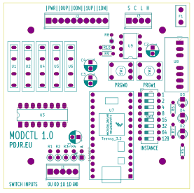

# MODCTL - NMEA 2000 windlass control interface module.

__MODCTL__ is an NMEA 2000 module which allows a physical control panel
made up of switches and indicators to operate one or two NMEA 2000
enabled windlasses.
The module uses the N2K [Windlass Network Messages](
https://www.nmea.org/Assets/20190613%20windlass%20amendment,%20128776,%20128777,%20128778.pdf)
protocol to transmit commands to and receive status information from
associated windlasses.

__MODCTL__ connects to the NMEA bus by a standard M12 5-pin circular
connector and is powered directly from the NMEA bus.
The module will accept supply voltages in the range 9VDC to 36VDC and
has an NMEA LEN of 1.

Switch input signals in the range 12VDC to 24VDC nominal are used to
command UP and DOWN windlass motion and zero-volt UP and DOWN output
relays support the connection of panel indicators.

__MODCTL__ is configured by a PCB mounted DIP switch which allows entry
of NMEA instance addresses which define the windlass or windlasses that
are to be controlled.
Status and diagnostic LEDs confirm NMEA connection and operating state
of the device.

Multiple control interface modules can be installed on a single NMEA
bus controlling the same or different windlasses as their peers.

## Connections

All connections are made by through screw connector blocks using 20AWG
wire.

| Block  | Terminal | Name | Rating   | Description |
|:------:|:--------:|:---- |:--------:|:------------|
| SWITCH | 1        | 0U   | 12/24VDC | Windlass 0 UP (active high). |
| SWITCH | 2        | 0D   | 12/24VDC | Windlass 0 DOWN (active high). |
| SWITCH | 3        | 1U   | 12/24VDC | Windlass 1 UP (active high). |
| SWITCH | 4        | 1D   | 12/24VDC | Windlass 1 DOWN (active high). |
| SWITCH | 5        | GND  | 0VDC     | Reference ground for terminals 1 through 4. |
| STATUS | 1-2      | 0UP  | 50V 1A   | Connected continuously when Windlass 0 is docked; intermittently when Windlass 0 is retrieving. |
| STATUS | 3-4      | 0DN  | 50V 1A   | Connected continuously when Windlass 0 is deployed; intermittently when Windlass 0 is deploying. |
| STATUS | 5-6      | 1UP  | 50V 1A   | Connected continuously when Windlass 1 is docked; intermittently when Windlass 1 is retrieving. |
| STATUS | 7-8      | 1DN  | 50V 1A   | Connected continuously when Windlass 1 is deployed; intermittently when Windlass 1 is deploying. |
| STATUS | 9-10     | PWR  | 50V 1A   | Connected when the module is powered, occulting each time a status message is received from a windlass. |
 
## Configuring the module

To operate correctly the module must be configured with the NMEA
instance address of the windlass or windlasses which are being
controlled.

To configure Windlass 0:

1. Connect the module to the NMEA bus and confirm that the PWR/RX LED
   is illuminated.
2. If you have connected switches to the SWITCH terminal block, then
   ensure that the switches are in the OFF position.
3. Enter the instance address of the windlass you wish to control
   using the DIP switch on the module PCB.
4. Press the PRG W0 button on the module PCB.

If the NMEA interface on the remote spudpole is powered up, then after
a few seconds the status outputs for Windlass 0 should become active
to indicate the condition of the windlass.
After this, the switch inputs for Windlass 0 should command the remote
windlass.

If a second windlass is to be controlled as Windlass 1, then use a
similar procedure, but press the PRG W1 button at step 4. 

## NMEA 2000 messages

In addition to the usual N2K network management messages the module
accepts the following message types and processes them to drive its
status outputs.

| PGN    | Message name                      | Comment               |
|:-------|:----------------------------------|:----------------------|
| 128776 | Anchor Windlass Control Status    | Drives status outputs |
| 128777 | Anchor Windlass Operating Status  | Drives status outputs |

The module issues the following control message types in response to
signals on the switch inputs.

| PGN    | Message name                      | Comment               |
|:-------|:----------------------------------|:----------------------|
| 126208 | Command Group Function            | 250ms transmition rate|

